# Getting Started

### INTRODUCTION

Image processing is a method to perform some operations on an image,in order to get an enhanced image or to extract some useful information from it. It is a type of signal processing in which input is an image and output may be an image or characteristics/features associated with that image. 

Antahsagri is an underwater ROV(Remotely Operated Vehicle) which uses camera for underwater exploriation but the output from camera usually get hampered by low contrast, color changes, and interference due, for example,camera noise and floating particles such as sea snow.Especially with cameras mounted on the ROV, these effects make observation more difficult and exhausting.

All this is achived using  OpenCV, Deep Learning, and Python programming language.

# OpenCV

### Underwater Object Detection Algorithms

### Meanshift 

The idea behind meanshift is that in meanshift algorithm every instance of the video is checked in the form of pixel distribution in that frame. We define an initial window, generally a square or a circle for which the positions are specified by ourself which identifies the area of maximum pixel distribution and tries to keep track of that area in the video so that when the video is running our tracking window also moves towards the region of maximum pixel distribution.Meanshift is a very useful method to keep track of a particular object inside a video. 

Read More:
1. https://opencv-python-tutroals.readthedocs.io/en/latest/py_tutorials/py_video/py_meanshift/py_meanshift.html
2. https://pysource.com/2018/04/05/object-tracking-with-mean-shift-opencv-3-4-with-python-3-tutorial-29/

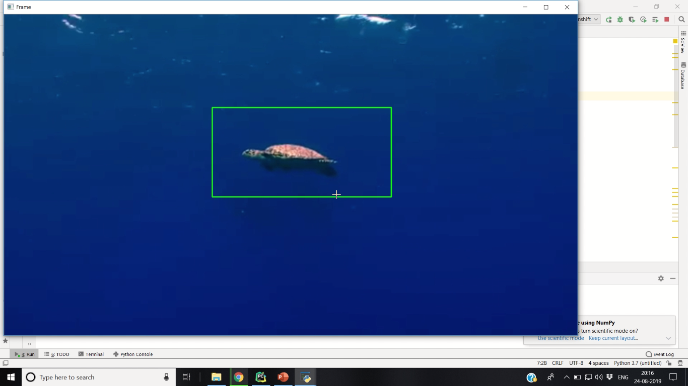

### KCF Tracker

KCF is a novel tracking framework that utilizes properties of circulant matrix to enhance the processing speed. This tracking method is an implementation of which is extended to KCF with color-names features.

Read More:
1. https://docs.opencv.org/3.4/d2/dff/classcv_1_1TrackerKCF.html
2. https://www.pyimagesearch.com/2018/07/30/opencv-object-tracking/

### Homography

A Homography is a transformation (a 3×3 matrix) that maps the points in one image to the corresponding locations in the other image. In homography, we used a query image, found some feature points in it, took another train image, found the features in that image too, and found the best matches among them.

Read More:
1. https://docs.opencv.org/master/d1/de0/tutorial_py_feature_homography.html
2. https://pysource.com/2018/06/05/object-tracking-using-homography-opencv-3-4-with-python-3-tutorial-34/

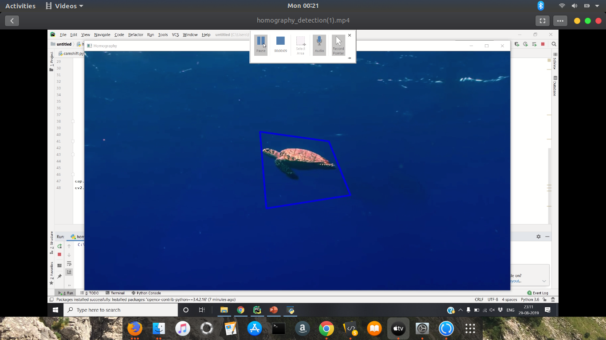

### Contour Detection and Tracking

Contours can be explained simply as a curve joining all the continuous points (along the boundary), having same color or intensity. The contours are a useful tool for shape analysis and object detection and recognition.

Read More:
1. https://docs.opencv.org/3.3.1/d4/d73/tutorial_py_contours_begin.html
2. https://www.youtube.com/watch?v=MkcUgPhOlP8

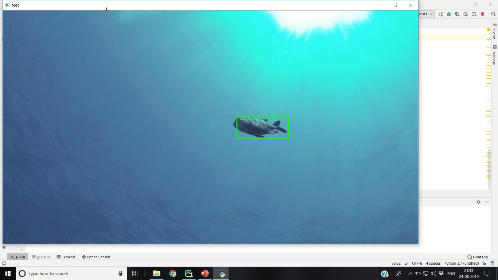

### Camshift

Camshift or we can say Continuously Adaptive Meanshift is an enhanced version of the meanshift algorithm which provides more accuracy and robustness to the model. With the help of Camshift algorithm, the size of the window keeps updating when the tracking window tries to converge. The tracking is done by using the color information of the object. Also, it provides the best fitting tracking window for object tracking.It then calculates the best fitting ellipse to it and again applies the meanshift with the newly scaled search window and the previous window. This process is continued until the required accuracy is met.

Read More:
1. https://www.geeksforgeeks.org/track-objects-with-camshift-using-opencv/
2. https://pysource.com/2018/04/09/object-tracking-with-camshift-opencv-3-4-with-python-3-tutorial-30/

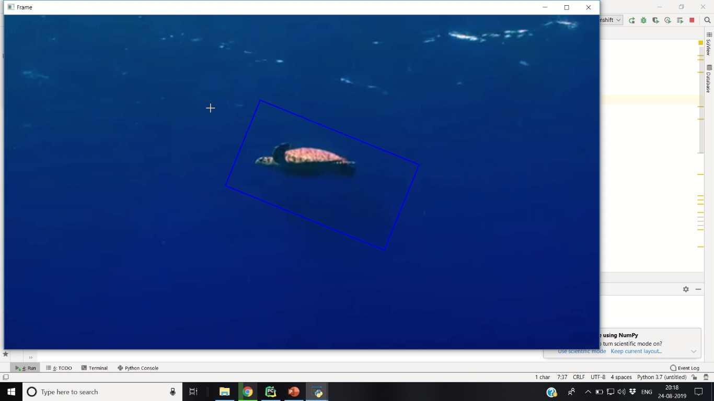

### Color based Object Detection

An object has many global features like color and shape, which describe the purpose as a whole. These features can be utilized to detect an object and track it in a sequence of frames. We will use color as a feature to identify an object with a particular color. This method is useful when an object is of a  specific color, and this color is different from the color of the background. If the object and environment have the same color, then this method for detection will fail.

Read More:
1. https://www.geeksforgeeks.org/detection-specific-colorblue-using-opencv-python/
2. https://www.youtube.com/watch?v=3D7O_kZi8-o

### Optical Flow

Optical flow is the motion of objects between consecutive frames of sequence, caused by the relative movement between the object and camera.Sparse optical flow selects a sparse feature set of pixels (e.g. interesting features such as edges and corners) to track its velocity vectors (motion). The extracted features are passed in the optical flow function from frame to frame to ensure that the same points are being tracked.

Read More:
1.https://opencv-python-tutroals.readthedocs.io/en/latest/py_tutorials/py_video/py_lucas_kanade/py_lucas_kanade.html
2.https://pysource.com/2018/05/14/optical-flow-with-lucas-kanade-method-opencv-3-4-with-python-3-tutorial-31/

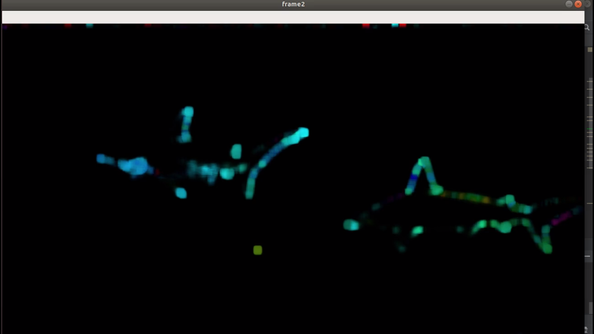

### Canny Edge Detection

Canny edge detection algorithm is used to detect a wide range of edges in images. OpenCV has in-built function cv2.Canny() which takes our input image as first argument and its aperture size(min value and max value) as last two arguments.

Read More:
1. https://docs.opencv.org/trunk/da/d22/tutorial_py_canny.html
2. https://www.youtube.com/watch?v=CGfXCkHNemo

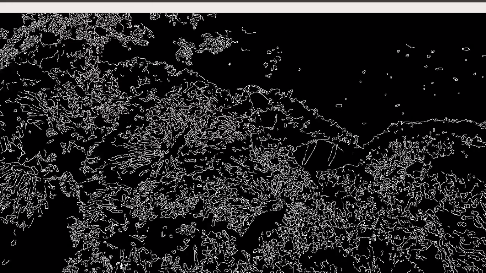

Link to results of above algorithms : https://drive.google.com/drive/folders/1E0kjh6NciFzA5rFDHYBqueFQQquGJSEK?usp=sharing

# Deep Learning 

Deep Learning Algorithms that we have used based on :
 - Classification
 - Detection
 - Segmentation
 
### Classification 
For image recognition,classification, firstly we trained our custom dataset on Convolutional Neural Network (custom) using keras and tensorflow libraries. To note that we haven't applied any filters on the input images. Though it was given with 98% training accuracy rate, 90% testing rate.
###### Result:
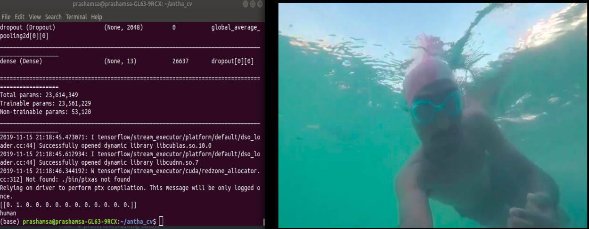
To know more about CNNs model https://www.tensorflow.org/tutorials/images/cnn. 

About different layers used in model [Explore here](https://keras.io/api/layers/convolution_layers/).

#### Transfer Learning 
###### ResNet50 :
We trained ResNet50 model(50 layer Residual Network) on custom dataset which resulted with 98.7% training accuracy and 95.7% test accuracy. This model is not loaded with weights of pretrained model and replaced last fully connected layer with own classifier. Built two models with different methods within pre-processing.
For proper understanding in using Resnet50 to custom dataset. Refer this [Blog](https://towardsdatascience.com/deep-learning-using-transfer-learning-python-code-for-resnet50-8acdfb3a2d38)
###### Result:
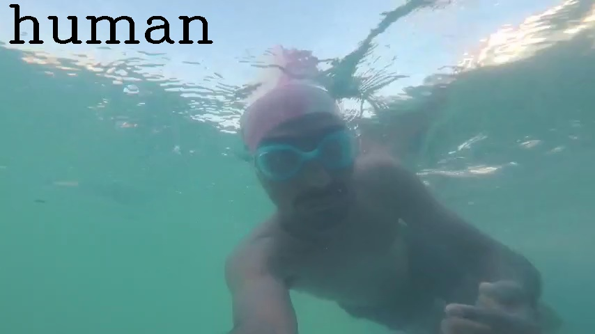

### Segmentation
The Mask Region-based Convolutional Neural Network, or Mask R-CNN, model is one of the state-of-the-art approaches for object recognition tasks. The [Matterport Mask R-CNN](https://github.com/matterport/Mask_RCNN) repository provides a library that allows you to develop and train Mask R-CNN Keras models for your own object detection tasks.
Trained Mask R-CNN using custom dataset having three classes. We used pretrained model [weights](https://github.com/matterport/Mask_RCNN/releases/download/v2.0/mask_rcnn_coco.h5) of MS-COCO dataset, by which time can be saved and performance can be improved.
##### Following are the results on test set:
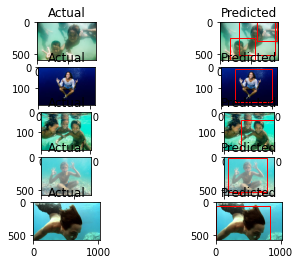

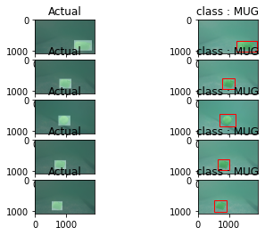

#### Progress
- Trying different pretained models and learning its architecture.
- For detection and segmentation purpose, working on Faster R-CNN, CenterNet and learning features, architecture and techniques required enough to create custom Neural Network for project. 
- Working on Image Enhancement Algorithms using Neural Networks and Computer Vision.

### Image Filters
- RGHS: Shallow-Water Image Enhancement Using Relative Global Histogram Stretching Based on Adaptive Parameter Acquisition 
- RayleighDistribution: Underwater image quality enhancement through composition of dual-intensity images and Rayleigh-stretching 
- UCM: Enhancing the low quality images using Unsupervised Colour Correction Method 
- HE: Image enhancement by histogram transformation 
- GC: Gamma Correction

These Underwater Image Enhancement Techniques were giving the best results.

#### Results
- The images enhanced by HE method present an overwhelming red tone and amplify the noises of the original image.
- RGHS are based on adaptive parameters to avoid a global histogram stretching or blind pixel redistribution to reduce sharpness.
- UCM may lead to under- and over-saturated images.
- Rayleigh Distribution veils local detailed information of the enhanced images.

These methods implemented on differents images shows different results.
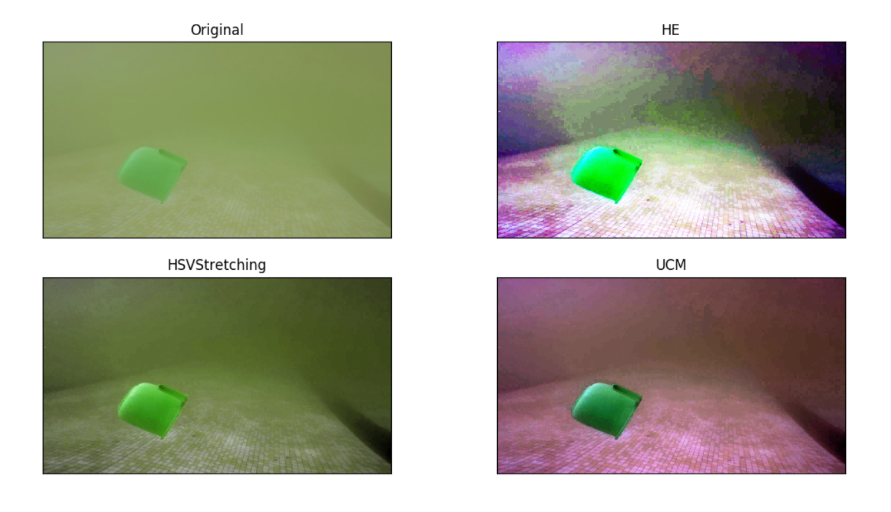
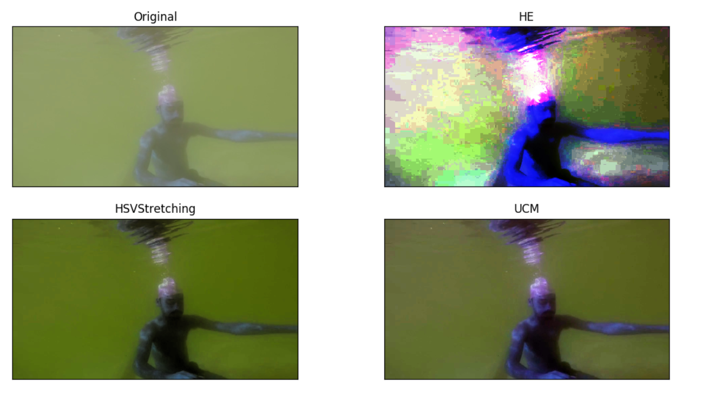
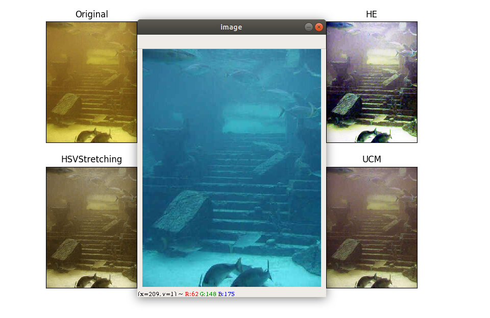

   
