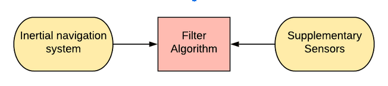
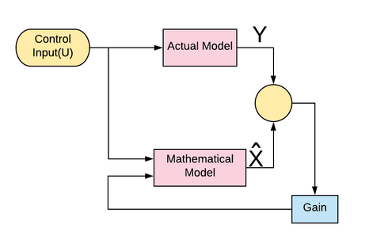
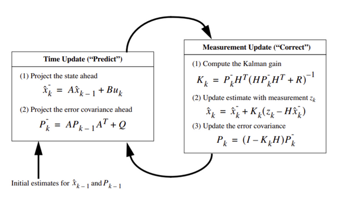
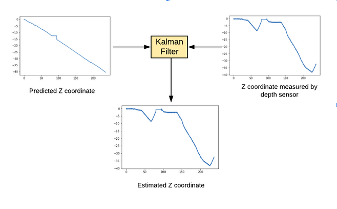

## INTRODUCTION

The acronym stands for Simultaneous Localization and Mapping. Let’s understand it with an example. Tushar is kidnapped and left in a dense forest by his enemies. He has no phone so he can’t communicate with anyone nor has accessibility to navigation tools like google maps or compass. Luckily there is abundant food in the forest. Now what he should do? 
There are broadly two possibilities - one is he accepts his fate and spends the rest of his life in the forest. The other option is that he figures out a way to get out of the forest. Talking about Tushar he has a good presence of mind and always keeps a pocket diary and a pen in his secret pocket. He starts from a place and notes down the distinguishable **landmarks**(features). Like Stones, trees, etc. of forest in his diary. Whenever he sees a new feature, he adds it in his diary. He is moving completely arbitrarily but carefully and consciously. Many times he encounters the same path giving him a strong hint about  connectivity between different paths . In some days he figures out a rough map of the forest with the help of which he rushes out of the forest.

Now what Tushar did above was the concept of **feature-based SLAM**. In technical terms, SLAM is the computational problem of constructing or updating a map of an unknown environment while simultaneously keeping track of an agent's location within it. It’s like a chicken-egg problem. You can build a map only if you know your absolute location at each point of the environment and if you want to determine your location in a surrounding you should have a pre-built map of the surrounding. But luckily we have certain algorithms for SLAM.

### Why feature-based SLAM is not suited for underwater environments

One of the most important factors for SLAM is the landmarks. Due to the unstructured characteristics of the environment, in most cases, there are no distinct objects or features. The turbidity disturbs the operation of sensors, particularly those based on light such as cameras and lasers.

### ALTERNATIVE

For underwater Environments, inertial navigation system fusion with other sensors is a popular method of localizing the ROV/AUV inside water. It comprises mainly three components.

- **Inertial navigation system(INS)** - This technique uses motion sensors(accelerometer), rotation sensors(gyroscope), and a computer to compute the position, velocity, and orientation of the ROV with respect to a known starting point.

- **Supplementary sensors** - Often the INS is aided with some additional sensors which include altimeters, DVLs(velocity measuring devices), LBL, USBL, SBL, GPS etc., to reduce the error in the dead-reckoning process.

- **Filter algorithm** - This carries out sensor data fusion of INS with supplementary sensors. One of the most fundamental filters, ***Kalman filter*** is used widely in many applications.

**Interesting fact** -  In the 1960s, the ***Kalman filter*** was applied to navigation for the Apollo Project, which required estimates of the trajectories of manned spacecraft going to the Moon and back.

### KALMAN FILTER 
Kalman filter is applicable for linear systems only. For nonlinear systems, it’s derivatives like extended kalman filter or unscented kalman filters are used.

### EQUATIONS

### PARAMETERS
- Error covariance matrix(P) -  Measure of the estimated accuracy of the state estimate. If the initial state is not very close to actual value then P is initialised with large values and vice versa.

- Process Noise covariance matrix(Q) - The Q matrix corresponds to the uncertainty that is expected in the state equations. 

- Measurement Noise matrix(R) - It measures the uncertainty in the sensor data.

Read more about kalman filter at::
http://ieeexplore.ieee.org/document/4588811/

Here’s the results of kalman filter for z coordinate implemented on data from SITL(Ardusub).

### SENSORS IN USE

- **9 DOF IMU** : The abbreviation stands for Inertial Measurement Unit which consists of 3 - axis accelerometer, 3-axis gyroscope and 3-axis magnetometers. Instead of IMU we have used a pixhawk controller which houses 2 IMUs and an implemented extended kalman filter to output accelerations in all 3 directions and Quaternions for roll, pitch and yaw estimation.

- **Depth/Pressure Sensor** : This sensor is used as a supplementary sensor to feed the depth measurement(z coordinate) into the filter.

- **Ping Sonar** : It is fitted at the bottom of the ROV, facing in downward direction for collecting depth values of river/lake/sea floor relative to ROV. The depth values are further processed to map these floors.

### OTHER SUPPLEMENTARY SENSORS 
- **DVL** : This stands for Doppler Velocity Log which uses the principle of ***doppler shift*** to measure ROV speed relative to the floor. It is one of the most reliable sensors in navigation but limited to big firms due to it’s high cost.

- **Underwater acoustic positioning system** : These include LBL, SBL, and USBL. These systems require great effort for installation, beyond a special demand for logistics, having a high cost. Besides, these solutions limit the area of operation of the robot.

Read more at : https://en.wikipedia.org/wiki/Underwater_acoustic_positioning_system

